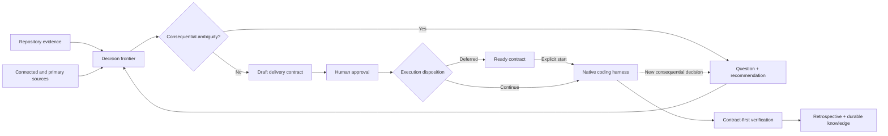

<p align="center">
  
</p>

<h1 align="center">Intentwise</h1>

<p align="center"><strong>Decide what matters. Delegate the rest.</strong></p>

<p align="center">
  <a href="LICENSE"></a>
  
  
</p>

Intentwise is a small, harness-agnostic Agent Skill for developers who want control over **intent and consequential decisions** without micromanaging an autonomous coding agent.

It helps the agent determine what “correct” means before implementation, gives the native harness freedom inside that boundary, and verifies the result against explicit evidence afterward.

```text
Intent → Implications → Consequential Decisions → Autonomy → Evidence
```

> Control the boundary within which any implementation path is acceptable—not the path itself.

## Why Intentwise?

Coding agents are increasingly good at planning and execution. The harder problem is making sure they build the right thing, surface the decisions you would care about, and prove the result without pulling you into every technical choice.

| Concern | Intentwise response |
| --- | --- |
| The request is underspecified | Inspect the repository, derive implications, and ask only about consequential outcomes. |
| Recommendations rely on model memory | Use repository evidence first, then authorized connected sources such as MCP-accessible documentation and other repositories, then current primary sources. |
| The agent asks too many implementation questions | Delegate local, reversible, conventional, and mechanical choices. |
| A plan becomes an execution bureaucracy | Preserve a compact delivery contract, not a task graph. |
| Implementation drifts from the agreement | Stop only when new information crosses the consequential-decision frontier. |
| “It works” is accepted without proof | Verify every criterion as `PASS`, `FAIL`, or `UNPROVEN` at an explicit evidence level. |
| The developer loses track of the system | Finish with an explanatory retrospective and optionally teach at conceptual checkpoints. |

Intentwise is **not** a planner, orchestrator, workflow engine, model router, task database, worktree manager, or replacement coding harness.

## How it works



1. **Discover:** inspect code, tests, configuration, project instructions, and documentation before asking anything.
2. **Research when it matters:** use available internal and current authoritative sources when they could materially change a consequential recommendation.
3. **Find the decision frontier:** separate human-owned outcomes and trade-offs from delegated implementation choices.
4. **Grill proportionally:** ask one consequence-focused question at a time, recommend the best fit, and stop at diminishing returns.
5. **Contract:** write one compact `DRAFT` contract and wait for explicit approval.
6. **Start or defer:** implement immediately when disposition is `CONTINUE`, or preserve an approved build-ready contract under `ready/` when it is `DEFERRED`.
7. **Delegate:** let Codex, Claude Code, or Copilot choose its own implementation path.
8. **Verify:** assess the agreed criteria independently against required and observed evidence.
9. **Teach and preserve:** record what changed, how it works, meaningful autonomous decisions, drawbacks, residual risks, and durable system knowledge.

Clear, low-consequence work collapses automatically: usually no interview and no contract.

## Quick start

Install the complete `skills/intentwise` directory into a location supported by your harness.

### Codex

```sh
mkdir -p .agents/skills
cp -R /path/to/intentwise/skills/intentwise .agents/skills/intentwise
```

Invoke it with:

```text
$intentwise Add reliable webhook retries.
```

Codex also supports personal installation at `~/.agents/skills/intentwise`. See [OpenAI — Build skills](https://developers.openai.com/codex/skills).

### GitHub Copilot

```sh
mkdir -p .github/skills
cp -R /path/to/intentwise/skills/intentwise .github/skills/intentwise
```

Reload and inspect it in Copilot CLI:

```text
/skills reload
/skills info intentwise
```

Then use:

```text
Use the /intentwise skill to add reliable webhook retries.
```

Copilot also recognizes `.agents/skills` and `.claude/skills` as repository skill locations, and `~/.copilot/skills` or `~/.agents/skills` for personal skills. See [GitHub — Adding agent skills for Copilot CLI](https://docs.github.com/en/copilot/how-tos/copilot-cli/customize-copilot/add-skills).

### Claude Code

```sh
mkdir -p .claude/skills
cp -R /path/to/intentwise/skills/intentwise .claude/skills/intentwise
```

Invoke Intentwise by name in your request. Claude Code also supports personal skills at `~/.claude/skills/intentwise`. See [Anthropic — Agent Skills](https://platform.claude.com/docs/en/agents-and-tools/agent-skills/overview).

The paths above were checked against the linked official documentation on August 21, 2026. Product support can change; consult the source for another surface or version.

## The approval boundary

For non-trivial work, Intentwise creates a contract under `.intentwise/drafts/` and stops. It never treats drafting the contract as permission to implement it.

```markdown
### D001 — Delivery guarantee

Choice: Use at-least-once delivery with a stable event identifier.

Rationale: Avoids silent loss while giving receivers a deduplication key.

Evidence basis: Existing webhook behavior plus HTTP standards.

Sources: Repository delivery tests; RFC 9110.

Applicability: Preserves the existing public payload contract.

## Execution

Disposition: CONTINUE

### AC01 — Recover transient failure

Expected: A delivery that first returns 503 and later returns 200 is retried with the same event identifier.

Required evidence: L3
Observed evidence: NONE
Result: UNPROVEN
Evidence: Not yet collected.
```

After reviewing the full contract, approve it explicitly:

```text
Approved. Implement it.
```

To preserve a build-ready contract without starting work, set `Disposition: DEFERRED` and say:

```text
Approve this contract, but defer implementation.
```

Intentwise moves it to `.intentwise/ready/`. A later explicit request to implement that contract moves it to `active/`; approval does not need to be repeated.

Everything not constrained by the approved intent, decisions, acceptance criteria, and evidence requirements remains delegated to the coding harness.

## Evidence, not confidence

Every acceptance criterion names a minimum evidence level:

| Level | Meaning | Can justify `PASS`? |
| --- | --- | --- |
| `L0` | A person or agent claims it works | No |
| `L1` | Static code, configuration, or documentation evidence | Yes, when L1 is required |
| `L2` | Deterministic test, type check, schema, linter, or assertion | Yes, when L2 or lower is required |
| `L3` | The actual scenario is executed and its observable result verified | Yes, when it addresses the criterion |

Intentwise never silently lowers the requirement:

- `PASS` — sufficient evidence at or above the required level.
- `FAIL` — evidence demonstrates a discrepancy.
- `UNPROVEN` — the behavior may exist, but adequate evidence was not obtained.

The included validator checks the contract’s internal structure and evidence-level consistency. It deliberately does **not** claim to prove product behavior.

```sh
python3 skills/intentwise/scripts/validate_contract.py \
  .intentwise/drafts/IW-142-webhook-retries.md
```

## Learning without approval theater

Intentwise supports three learning modes:

- `COMPLETION` — teach through the final delivery retrospective.
- `CHECKPOINTS` — add concise, non-blocking explanations, diagrams, and optional comprehension questions at meaningful conceptual boundaries.
- `OFF` — omit educational commentary while retaining the factual retrospective.

Learning changes the timing of explanation, not the agent’s authority. A checkpoint is not an approval gate.

## Project-local memory

Everything generated by Intentwise stays under `.intentwise/`:

```text
.intentwise/
├── index.md
├── drafts/                 # shaping or awaiting approval
├── ready/                  # approved and intentionally not started
├── active/                 # implementation or verification underway
├── completed/              # immutable verified delivery records
├── knowledge/              # mutable current system knowledge
│   ├── architecture/
│   ├── decisions/
│   ├── external/
│   └── operations/
└── assets/                 # explanatory media, separate from knowledge
    ├── diagrams/
    ├── images/
    └── visualizations/
```

Contracts retain the same filename as they move through `drafts/ → ready/ or active/ → completed/`. Each session owns only the contract it created or was explicitly asked to resume. Shared knowledge uses optimistic, convention-based reconciliation rather than locks or an orchestration service.

Persistent Markdown uses an [OKF-compatible](https://okf.md/spec/) typed frontmatter envelope. Completed contracts remain immutable provenance; knowledge documents describe what is currently true.

Explore the [complete golden delivery](examples/golden-delivery/.intentwise/completed/IW-204-evidence-integrity.md), including its [durable architecture knowledge](examples/golden-delivery/.intentwise/knowledge/architecture/intentwise-evidence-validation.md) and separate [evidence-flow asset](examples/golden-delivery/.intentwise/assets/diagrams/evidence-flow.svg).

## Design principles

- **Repository-first:** never ask the developer what the codebase can establish.
- **Consequence-first:** uncertainty alone does not earn a question.
- **Evidence-backed:** recommendations expose their sources and applicability.
- **Adaptive depth:** decision density, not task size, controls the ceremony.
- **Native autonomy:** execution topology and implementation order belong to the harness.
- **Contract-first verification:** compare evidence with the agreement, not implementation claims.
- **Durable learning:** preserve current system knowledge without turning contracts into a documentation dump.

Read the full [design principles](docs/principles.md), [contract template](skills/intentwise/references/contract-template.md), and [worked examples](examples/).

## Development

Intentwise has no runtime dependencies. The optional structural validator requires Python 3.10 or newer and uses only the standard library.

```sh
python3 -m unittest discover -s tests -v

python3 skills/intentwise/scripts/validate_contract.py tests/fixtures/valid.md
python3 skills/intentwise/scripts/validate_contract.py examples/webhook-retries.md
python3 skills/intentwise/scripts/validate_contract.py examples/foundry-telemetry.md
```

The invalid fixture is expected to exit with code `1`:

```sh
python3 skills/intentwise/scripts/validate_contract.py tests/fixtures/invalid.md
```

## Repository layout

```text
skills/intentwise/
├── SKILL.md
├── references/
└── scripts/validate_contract.py
docs/
├── assets/intentwise-hero.png
└── principles.md
examples/
tests/
LICENSE
```

Intentwise is available under the [MIT License](LICENSE).
