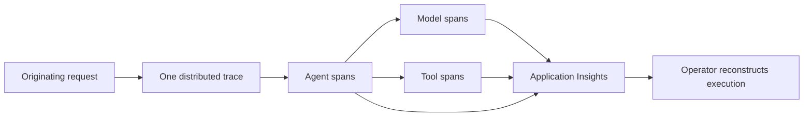

# Example — Foundry Agent Telemetry (architectural)

Status: APPROVED

## Intent

Add production-grade telemetry for Foundry agents in Application Insights.

## Outcome

A production operator can reconstruct a complete multi-agent execution, attribute latency, cost, and errors to the responsible operation, and do so without storing prompt or response content.

## Target Experience



The operator starts from one request and sees its agent, model, and tool work as one correlated trace. Production shows operational attributes but never prompt or response bodies.

## Interaction States

| Trigger or state | Observable result | Persistent meaning or evidence |
| --- | --- | --- |
| A production request executes delegated work | One trace shows parent-child operation order | Stable attributes support latency, cost, and status queries |
| A tool fails | Its span records failure and a normalized error category | The responsible operation remains attributable |
| Content capture is explicitly enabled in sandbox or development | Prompt and response capture becomes available there | Production capture remains prohibited and every environment defaults to off |

## Experience Rules

- One originating request maps to one distributed trace.
- Agent, model, and tool operations remain independently attributable.
- Production telemetry never stores prompt or response bodies.
- Content capture outside production is explicit and disabled by default.
- Correlation uses the existing telemetry export path rather than a new orchestration layer.

## Success Scenario

A production request delegates agent, model, and tool work and one tool fails. An operator opens the trace in Application Insights, follows the execution order, identifies the failed tool through its normalized category, attributes latency and token usage to the responsible operations, and finds no prompt or response content.

## Consequential Decisions

### D001 — Trace boundary

Choice: Represent one originating request as one distributed trace, with delegated agent and tool work as descendant spans.

Rationale: Per-agent traces would reduce coupling but make cross-agent handoffs and the critical path expensive to reconstruct.

Evidence basis: Existing repository trace propagation plus the current OpenTelemetry trace model.

Sources: Repository telemetry configuration; https://opentelemetry.io/docs/concepts/signals/traces/

Applicability: The project already exports OpenTelemetry data, so a parent-child span hierarchy extends its current boundary instead of adding a second correlation system.

### D002 — Production content privacy

Choice: Prohibit prompt and response bodies in production telemetry. Permit explicit content capture in sandbox and development only, with capture disabled by default in every environment.

Rationale: Non-production capture preserves an intentional path for semantic debugging without creating an always-on second store of potentially sensitive customer content.

Evidence basis: Repository environment boundaries plus current Azure Monitor OpenTelemetry configuration guidance.

Sources: Repository sandbox/dev/prod configuration; https://learn.microsoft.com/en-us/azure/azure-monitor/app/opentelemetry-enable

Applicability: Environment-specific configuration already exists, allowing content capture to remain opt-in outside production without creating another deployment mechanism.

### D003 — Queryable attribution

Choice: Use stable span attributes: agent spans include `agent.name`, `conversation_id`, `duration`, and `status`; model spans include `model`, `input_tokens`, `output_tokens`, `latency`, and `status`; tool spans include `tool.name`, `duration`, `status`, and normalized `error.category`.

Rationale: Stable dimensions support operational queries and cost attribution without parsing span names or logs.

Evidence basis: Existing `conversation_id` usage plus current OpenTelemetry semantic-convention guidance.

Sources: Repository correlation code; https://opentelemetry.io/docs/specs/semconv/

Applicability: Stable attributes fit the existing exporter and make repository-specific agent identity queryable without redefining trace identity.

## Constraints

- Use the repository's existing telemetry export path and Application Insights destination.
- Preserve trace context across delegated work.
- Do not add an orchestration layer to achieve correlation.

## Delivery Strategy Expectations

- Reach an independently testable trace through agent, model, and tool spans early when practical; exact implementation order remains delegated.
- Keep the existing export path deployable while instrumentation is introduced.

## Learning Mode

Mode: CHECKPOINTS

## Execution

Disposition: DEFERRED

## Maintainability Expectations

- Define stable telemetry attributes through one repository-consistent boundary rather than duplicating names across agents; verified by AC05.
- Preserve the existing export abstraction so Application Insights remains a destination rather than a domain dependency; verified by AC05.

## Acceptance Criteria

### AC01 — Reconstruct execution

Expected: A multi-agent request appears as one trace whose spans reveal agent, model, and tool execution order.

Required evidence: L3

Planned verification: Execute an instrumented request that delegates agent, model, and tool work, query the exported trace, and assert one trace with the expected parent-child execution order.

Observed evidence: NONE

Result: UNPROVEN

Evidence: Not yet collected.

### AC02 — Query agent and model activity

Expected: Agent spans expose agent name, conversation identifier, duration, and status; model spans expose model, input and output tokens, latency, and status.

Required evidence: L3

Planned verification: Execute a known agent and model interaction, query the emitted spans, and assert the required identity, correlation, duration, token, latency, and status attributes.

Observed evidence: NONE

Result: UNPROVEN

Evidence: Not yet collected.

### AC03 — Attribute tool failures

Expected: Tool spans expose tool name, duration, and status, and failures use a normalized `error.category` rather than relying on free-form messages.

Required evidence: L3

Planned verification: Force a known tool failure, query its exported span, and assert tool identity, duration, failure status, and the expected normalized error category without relying on message parsing.

Observed evidence: NONE

Result: UNPROVEN

Evidence: Not yet collected.

### AC04 — Control content capture

Expected: Production telemetry contains no prompt or response payload content; sandbox and development capture can be explicitly enabled but is disabled by default.

Required evidence: L2

Planned verification: Run deterministic telemetry serialization and environment-configuration tests that assert production omits content and every environment defaults capture to disabled while sandbox and development can opt in.

Observed evidence: NONE

Result: UNPROVEN

Evidence: Not yet collected.

### AC05 — Preserve the telemetry boundary

Expected: Stable attribute definitions have one authoritative implementation, existing export configuration remains the integration boundary, and deterministic schema tests cover agent, model, and tool attributes.

Required evidence: L2

Planned verification: Run the authoritative attribute-schema tests and export-configuration tests, and assert that agent, model, and tool instrumentation consume that schema through the existing exporter boundary.

Observed evidence: NONE

Result: UNPROVEN

Evidence: Not yet collected.

## Agent Autonomy

Instrumentation helpers, processor selection, module organization, attribute constants, and test organization remain delegated so long as they satisfy the decisions and existing repository conventions.

## Anticipated Change Surface

Advisory forecast only; implementation may use different files without renewed approval unless a consequential decision changes.

```text
src/
└── telemetry/
    ├── instrumentation.py  [modify]
    └── attributes.py       [create]
tests/
└── test_telemetry.py       [create]
```

## Actual Change Surface

Not populated until implementation.

## Delivery Retrospective

Complete after implementation.

## Knowledge Promotion

- Task-local knowledge retained only in this contract: <summary or none>
- Knowledge concepts created or updated: <project-relative paths or none>
- Assets created or updated: <project-relative paths or none>
