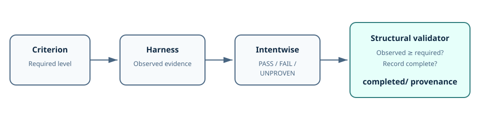

# Current State

Every acceptance criterion records a required evidence level, the strongest level actually observed, a result, and concrete evidence. PASS is structurally invalid when observed evidence is absent or below the requirement.

# How It Works

The delivery agent evaluates the real evidence against the acceptance criterion. The dependency-free validator then checks the record's internal structure and level ordering. These responsibilities remain separate: the validator can reject an inconsistent claim, but it cannot establish that a cited test or observation is truthful.

After all criteria pass, Intentwise completes the retrospective and knowledge-promotion record, validates the contract, and moves it to `completed/`. Knowledge concepts link to completed records for immutable provenance.

# Limitations

- Evidence quality and relevance still require agent judgment.
- Shared knowledge updates use optimistic, convention-based reconciliation rather than locks.
- Rich assets depend on host capabilities; Markdown, ASCII, or Mermaid remain portable fallbacks.

# Provenance

- [Evidence-level integrity delivery](../../completed/IW-204-evidence-integrity.md)
