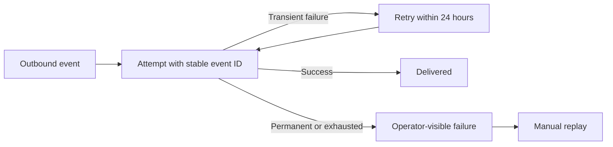

# Example — Webhook retries (medium feature)

Status: APPROVED

## Intent

Retry failed outbound webhooks so transient receiver failures do not lose customer events.

## Outcome

Transient delivery failures recover automatically while receivers can safely recognize duplicate attempts and operators can diagnose final failures.

## Target Experience



Delivery begins with one stable event identity. Recoverable failures loop through bounded retries; permanent or exhausted failures remain visible and replayable.

## Interaction States

| Trigger or state | Observable result | Persistent meaning or evidence |
| --- | --- | --- |
| Receiver returns 503, then 200 | Delivery retries and finishes as delivered | Every attempt carries the same event identifier |
| Receiver returns 400 | Delivery stops after one attempt | The permanent failure remains diagnosable |
| Retry window expires | Delivery becomes operator-visible as failed | Manual replay remains available |

## Experience Rules

- Every attempt for one event uses the same public event identifier.
- Retryable and permanent failures are identifiable without inspecting free-form logs.
- Final failure is visible and manually recoverable.
- Logs and failure records expose neither signing secrets nor full payloads.

## Success Scenario

A receiver first returns 503 and later returns 200. The delivery flow retries within the approved window, preserves the event identifier across attempts, records the delivery as successful, and exposes no secret or full payload in operational records.

## Consequential Decisions

### D001 — Delivery guarantee

Choice: Use at-least-once delivery with a stable event identifier on every attempt.

Rationale: It avoids silent loss and gives receivers a practical deduplication key without promising impossible exactly-once delivery.

Evidence basis: Existing webhook payload contract and receiver-facing event identifier semantics.

Sources: Repository webhook schema and delivery tests.

Applicability: Reusing the public event identifier preserves payload compatibility and gives receivers a deduplication key across attempts.

### D002 — Retry boundary

Choice: Retry timeouts, connection failures, HTTP 429, and HTTP 5xx for up to 24 hours; do not retry other HTTP 4xx responses.

Rationale: This targets transient failures without repeatedly sending requests that the receiver has rejected as invalid.

Evidence basis: Existing outbound-delivery behavior plus HTTP status semantics defined by IETF standards.

Sources: Repository delivery client; https://www.rfc-editor.org/rfc/rfc9110; https://www.rfc-editor.org/rfc/rfc6585

Applicability: The current transport exposes connection failures and HTTP status codes directly, so the standard classifications can be centralized without changing the public webhook contract.

### D003 — Exhausted deliveries

Choice: Retain an operator-visible failed-delivery record with manual replay.

Rationale: Final failure must be diagnosable and recoverable without hiding it behind indefinite retries.

Evidence basis: Existing operator-facing delivery records and the product requirement for recoverable final failure.

Sources: Repository delivery persistence and operations documentation.

Applicability: Extending the existing failed-delivery record avoids introducing a separate operational queue or control plane.

## Constraints

- Preserve the existing webhook payload schema.
- Do not expose secrets or full payloads in logs.

## Delivery Strategy Expectations

- Preserve deployability and payload compatibility while retry behavior is introduced; implementation order remains delegated.

## Learning Mode

Mode: COMPLETION

## Execution

Disposition: DEFERRED

## Maintainability Expectations

- Reuse the repository's existing outbound-delivery boundary and keep retry classification centralized; verified by AC04.
- Preserve the public payload schema and stable event identifier; verified by AC01 and AC05.

## Acceptance Criteria

### AC01 — Recover transient failure

Expected: A webhook that first returns 503 and later returns 200 is retried and recorded as delivered with the same event identifier.

Required evidence: L3

Planned verification: Exercise a receiver fixture that returns 503 and then 200, and assert multiple attempts, one stable event identifier, and a final delivered record.

Observed evidence: NONE

Result: UNPROVEN

Evidence: Not yet collected.

### AC02 — Stop permanent client errors

Expected: A webhook returning 400 is attempted once and recorded as failed without an automatic retry.

Required evidence: L3

Planned verification: Exercise a receiver fixture that returns 400 and assert exactly one attempt, no scheduled retry, and a final failed record.

Observed evidence: NONE

Result: UNPROVEN

Evidence: Not yet collected.

### AC03 — Preserve secret data

Expected: Retry logs and failed-delivery records contain neither signing secrets nor full payload bodies.

Required evidence: L2

Planned verification: Run deterministic delivery and persistence tests with signing secrets and payload bodies in the input, capture logs and failed records, and assert that neither sensitive value is present.

Observed evidence: NONE

Result: UNPROVEN

Evidence: Not yet collected.

### AC04 — Centralize retry classification

Expected: One authoritative classification determines retryable and permanent failures, and deterministic tests cover every approved response category.

Required evidence: L2

Planned verification: Run table-driven classification tests covering timeouts, connection failures, HTTP 429, every HTTP 5xx class, and non-retryable HTTP 4xx responses against one authoritative classifier.

Observed evidence: NONE

Result: UNPROVEN

Evidence: Not yet collected.

### AC05 — Preserve the public delivery contract

Expected: The webhook payload schema is unchanged and every retry attempt carries the same stable event identifier.

Required evidence: L2

Planned verification: Run payload-schema compatibility tests and a multi-attempt delivery test that asserts the public schema is unchanged and the event identifier remains stable.

Observed evidence: NONE

Result: UNPROVEN

Evidence: Not yet collected.

## Agent Autonomy

Queue technology, retry scheduling mechanics, module boundaries, database access patterns, and test organization remain delegated to the implementation agent unless the repository already constrains them.

## Anticipated Change Surface

Advisory forecast only; implementation may use different files without renewed approval unless a consequential decision changes.

```text
src/
└── webhooks/
    ├── delivery.py       [modify]
    └── retry_policy.py   [create]
tests/
└── test_webhook_retries.py [create]
```

## Actual Change Surface

Not populated until implementation.

## Delivery Retrospective

Complete after implementation.

## Knowledge Promotion

- Task-local knowledge retained only in this contract: <summary or none>
- Knowledge concepts created or updated: <project-relative paths or none>
- Assets created or updated: <project-relative paths or none>
